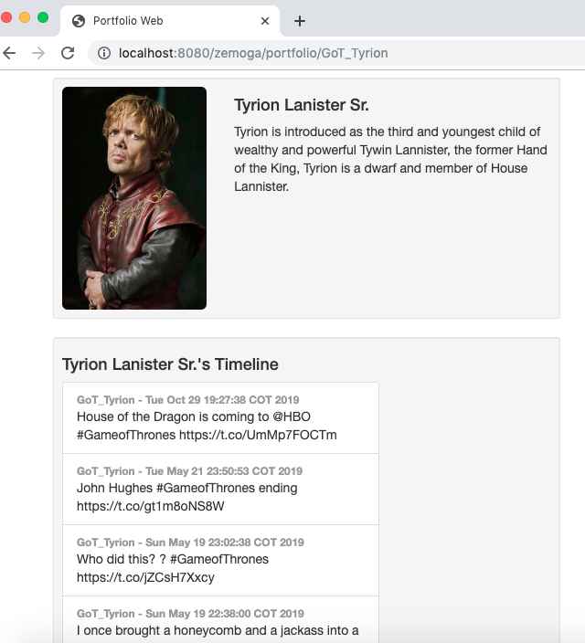

Detailed step list to get the application up an running:
--------------------------------------------------------

1. Download Apache Tomcat (9.0.27) https://tomcat.apache.org/download-90.cgi
2. Update the configuration files (https://github.com/julianpicon/Portfolio_Web/tree/master/Apache%20Tomcat)
3. Start Apache Tomcat
3. Go to Web Server Admin Console http://localhost:8080/manager
4. Upload the application WAR file into the Web Server (https://github.com/julianpicon/Portfolio_Web/tree/master/files)
5. Go to {App End point}/portfolio/{twitterUserName} (For example: http://localhost:8080/zemoga/portfolio/GoT_Tyrion) - Validate Web Servers' Application context
6. Rest API End Points: (It is clarified that the names of the endpoints proposed in the statement were modified)

Rest API End Points:
--------------------------------------------------------------------------------------------------------------
    (It is clarified that the names of the endpoints proposed in the statement were modified)
    
    [GET] localhost:8080/zemoga/api/v1/users
    [GET] localhost:8080/zemoga/api/v1/users/1
    [PUT] localhost:8080/zemoga/api/v1/users/4

Software prerequisites:
-----------------------

1. Apache Tomcat 9.0.27 (updated server.xml and context.xml files)
2. JDK 11
3. Maven

Steps to build the app:
-----------------------

1. Use the IDE (IntelliJ) to generate the WAR or 
1. Use the maven (clean / install) commands to generate the distributables (war).

Total time: 14 

